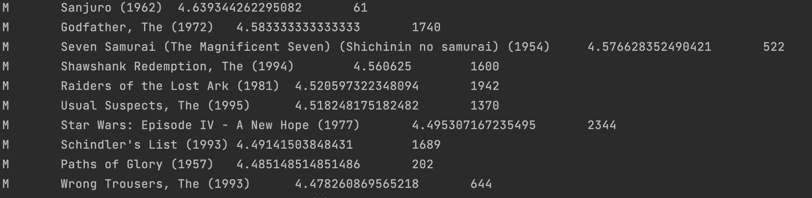

# BigDataTraining


### W2 Homework - MapReduce


### W3 homework - HBase

1. create namespace
```shell
create_namespace '陳宏育'
```

### W4,5 Homework - Hive

Homework folder: w4_hw_hive

create table and insert data into table

```shell
$ hive -f w4_hw_hive/create_table.sql
```

q1
```shell 
$ hive -f w4_hw_hive/q1.sql
```


q2
```shell
$ hive -f w4_hw_hive/q2.sql
```

